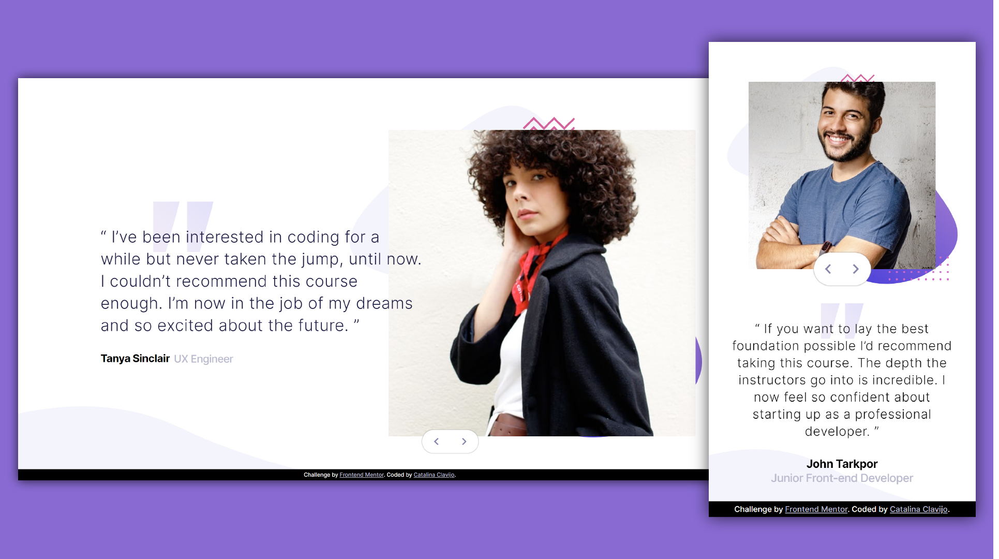

# Frontend Mentor - Coding bootcamp testimonials slider

## HTML - CSS - jQuery / Responsive

This is a solution to the [Coding bootcamp testimonials slider challenge on Frontend Mentor](https://www.frontendmentor.io/challenges/coding-bootcamp-testimonials-slider-4FNyLA8JL). 

## Screenshot

### Links

- Live Site URL: [https://cataclas.github.io/Frontend-Mentor_Coding-bootcamp-testimonials-slider/](https://cataclas.github.io/Frontend-Mentor_Coding-bootcamp-testimonials-slider/)

## Built with

- Semantic HTML5 markup
- [CSS custom properties](https://devdocs.io/css/)
- Grid
- Flexbox
- Responsive

## Author

- Frontend Mentor - [@Cataclas](https://www.frontendmentor.io/profile/Cataclas)
- GitHub - [Cataclas](https://github.com/Cataclas)
